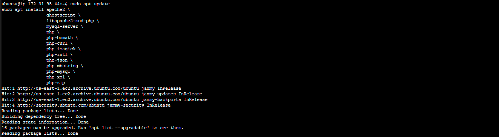
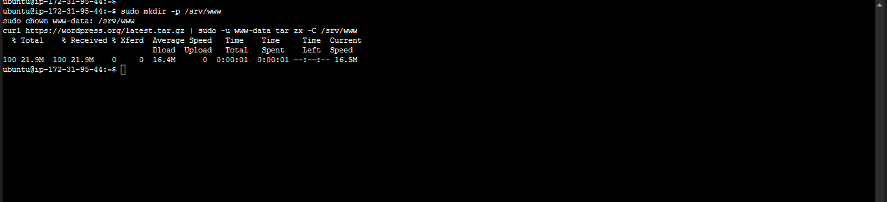
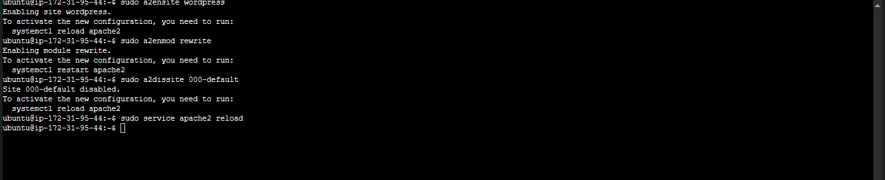
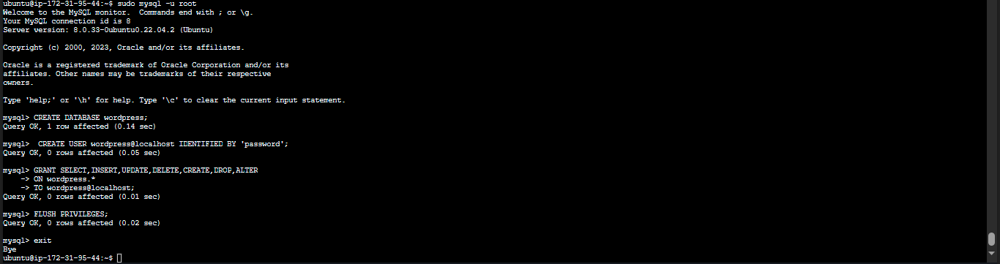
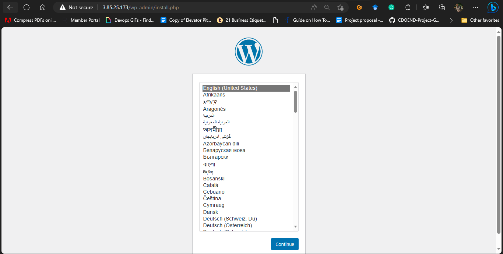
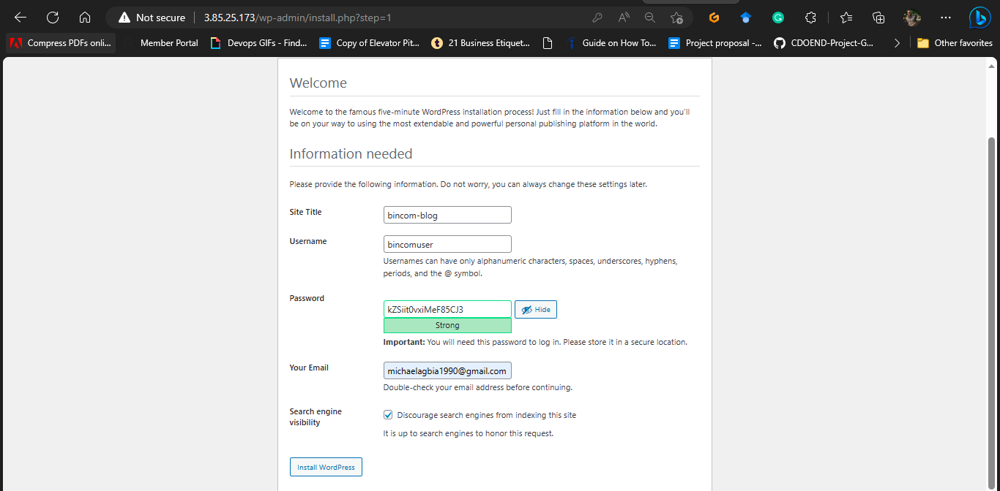
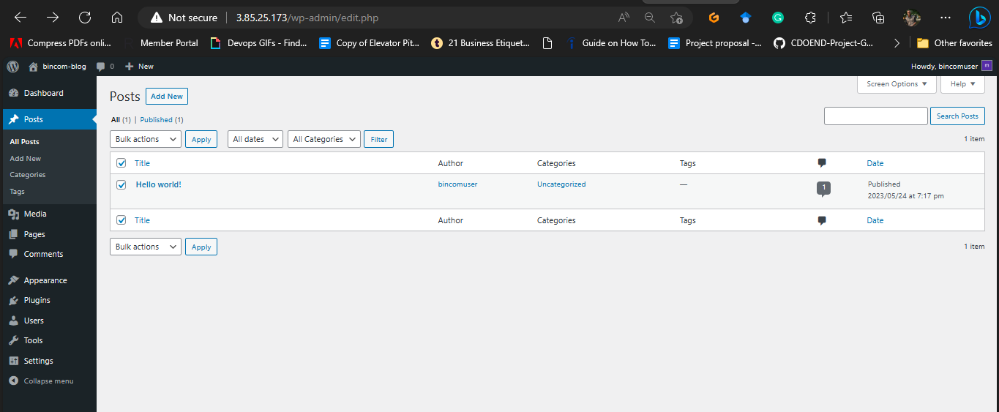

## **How to Install and Set Up WordPress on Ubuntu Version 20.04 LTS 0r Higher**

WordPress is a popular open-source content management system (CMS) that is based on PHP and MySQL. It is easy to use and customize, and it has a wide range of features that can be extended with thousands of free plugins and themes.

Some of the key features of WordPress are:

- **Ease of use:** 
  
  WordPress is designed to be easy to use, even for beginners. The user interface is intuitive and easy to navigate, and there are plenty of resources available to help you get started.

- **Customization:**
  
  WordPress is highly customizable. You can change the look and feel of your website with a variety of themes, and you can add new features and functionality with plugins.

- **Scalability:**

  WordPress is scalable, meaning that it can be used to create websites of any size. Whether you're creating a personal blog or a large corporate website, WordPress can handle it.

- **Community:**
  
  WordPress has a large and active community of users and developers. This means that there is always help available if you need it, and there are always new features and improvements being developed.

## **Requirements to WordPress**

- Ubuntu 20.04 0r higher
- System Requirements 1GB of RAM, 2 CPU Cores, 1 GB of Disk space
- Apache2 Webserver which  is one of the most popular web servers in the world.
- MYSQL 5.0 or higher: MYSQL is a popular database management system used within PHP environments
- PHP7.4 or higher which is a general-purpose open-source scripting language and one of the most popular programming languages for web development

## **Step 1: Install Dependencies**

To install PHP and Apache, use following command:

    sudo apt update
    sudo apt install apache2 \
                    ghostscript \
                    libapache2-mod-php \
                    mysql-server \
                    php \
                    php-bcmath \
                    php-curl \
                    php-imagick \
                    php-intl \
                    php-json \
                    php-mbstring \
                    php-mysql \
                    php-xml \
                    php-zip

## **Step 2: Install WordPress**

Create the installation directory and download the file from <a href="http://wordpress.org/"><b>WordPress.org:</b></a> 

    sudo mkdir -p /srv/www
    sudo chown www-data: /srv/www
    curl https://wordpress.org/latest.tar.gz | sudo -u www-data tar zx -C /srv/www

## **Step 3: Configure Apache for WordPress**

Create Apache site for WordPress. Create /etc/apache2/sites-available/wordpress.conf with following lines:

    <VirtualHost *:80>
        DocumentRoot /srv/www/wordpress
        <Directory /srv/www/wordpress>
            Options FollowSymLinks
            AllowOverride Limit Options FileInfo
            DirectoryIndex index.php
            Require all granted
        </Directory>
        <Directory /srv/www/wordpress/wp-content>
            Options FollowSymLinks
            Require all granted
        </Directory>
    </VirtualHost>

Enable the site with:

    sudo a2ensite wordpress

Enable URL rewriting with:

    sudo a2enmod rewrite

Disable the default “It Works” site with:

    sudo a2dissite 000-default

Finally, reload apache2 to apply all these changes:

    sudo service apache2 reload

## **Step 4: Configure database**

We need to create MySQL database.

    sudo mysql -u root

    Welcome to the MySQL monitor.  Commands end with ; or \g.
    Your MySQL connection id is 7
    Server version: 8.0.33-0ubuntu22.04.2 (Ubuntu)

    Copyright (c) 2000, 2023, Oracle and/or its affiliates. All rights reserved.

    Oracle is a registered trademark of Oracle Corporation and/or its
    affiliates. Other names may be trademarks of their respective
    owners.

    Type 'help;' or '\h' for help. Type '\c' to clear the current input statement.

    mysql> CREATE DATABASE wordpress;
    Query OK, 1 row affected (0,14 sec)

    mysql> CREATE USER wordpress@localhost IDENTIFIED BY 'password';
    Query OK, 1 row affected (0,05 sec)

    mysql> GRANT SELECT,INSERT,UPDATE,DELETE,CREATE,DROP,ALTER
        -> ON wordpress.*
        -> TO wordpress@localhost;
    Query OK, 1 row affected (0,01 sec)

    mysql> FLUSH PRIVILEGES;
    Query OK, 1 row affected (0,02 sec)

    mysql> quit
    Bye

Enable MySQL with
    
     sudo service mysql start

## **Step 5: Configure WordPress to connect to the database**

To configure WordPress to use this database, copy the sample configuration file to wp-config.php:

sudo -u www-data cp /srv/www/wordpress/wp-config-sample.php /srv/www/wordpress/wp-config.php
Next, set the database credentials in the configuration file (do not replace database_name_here or username_here in the commands below. Do replace <your-password> with your database password.):

    sudo -u www-data sed -i 's/database_name_here/wordpress/' /srv/www/wordpress/wp-config.php
    sudo -u www-data sed -i 's/username_here/wordpress/' /srv/www/wordpress/wp-config.php
    sudo -u www-data sed -i 's/password_here/password/' /srv/www/wordpress/wp-config.php

Open the configuration file in nano:

sudo -u www-data vi /srv/www/wordpress/wp-config.php

Find the following:

    define( 'AUTH_KEY',         'put your unique phrase here' );
    define( 'SECURE_AUTH_KEY',  'put your unique phrase here' );
    define( 'LOGGED_IN_KEY',    'put your unique phrase here' );
    define( 'NONCE_KEY',        'put your unique phrase here' );
    define( 'AUTH_SALT',        'put your unique phrase here' );
    define( 'SECURE_AUTH_SALT', 'put your unique phrase here' );
    define( 'LOGGED_IN_SALT',   'put your unique phrase here' );
    define( 'NONCE_SALT',       'put your unique phrase here' );

## **Step 6: Configure WordPress**

To complete the installation, go to http://yourpublicipaddress

Choose your language then click Next

Add information about your blog and click on install.

**NOTE:** The username and password you choose here are for WordPress and not for your server login or MYSQL credentials.

After installation, a window will appear which will require you to login with th credentials previously created for WordPress.

---

## 🔗 Contacts

## MICHAEL AGBIAOWEI

